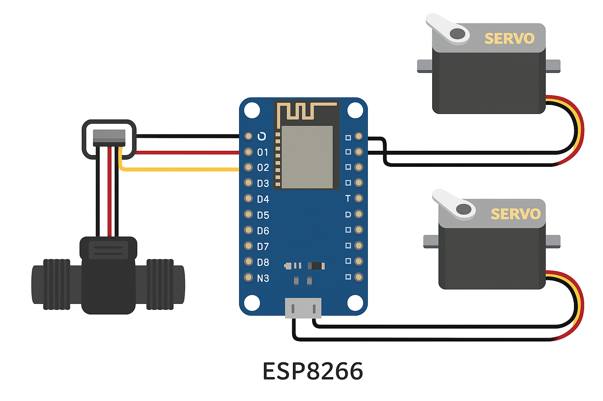

# FaceBeer
Controle automatizado de torneiras usando ESP8266, servos e sensor de fluxo, com endpoints HTTP para servir volumes específicos, ajustar vazão e gerenciar a abertura da torneira.

## Overview de Hardware (Imagem meramente ilustrativa)

## Funcionalidades

- Controle de **abertura da torneira** com servo motor, movimentação suave para maior torque.
- **Regulação de vazão** por servo motor adicional.
- Medição precisa de **volume servido** usando sensor de fluxo.
- Comunicação via **Wi-Fi** com endpoints HTTP.
- **Endpoints implementados**:
  - `/` → Healthcheck (retorna 200 OK)
  - `/servir?ml=<valor>` → Serve um volume específico em mL
  - `/sangria` → Abre a torneira por 10s para teste ou limpeza
  - `/torneira?set=<valor>` → Define posição fechada da torneira
  - `/torneira?offset=<valor>` → Ajusta posição fechada incrementalmente
  - `/vazao?set=<valor>` → Define posição da válvula de vazão
  - `/vazao?offset=<valor>` → Ajusta posição da válvula de vazão incrementalmente

## Componentes

- ESP8266 (NodeMCU)
- Servo motor para torneira principal
- Servo motor para válvula de vazão
- Sensor de fluxo YF-S201
- Fonte de alimentação adequada (GND comum entre ESP e servos)

## Instalação e Setup

1. Conecte o ESP8266 ao computador e abra a IDE Arduino.
2. Instale a biblioteca **ESP8266WiFi** e **ESP8266WebServer**.
3. Configure o SSID e senha do Wi-Fi no arquivo de código.
4. Conecte os servos e sensor de fluxo conforme os pinos definidos:
   - Torneira: GPIO2 (D4)
   - Vazão: GPIO14 (D5)
   - Sensor: GPIO5 (D1)
5. Compile e envie o código para o ESP8266.
6. Acesse os endpoints via navegador ou aplicativo HTTP.

## Uso

Exemplos de requisições HTTP:

- `http://<IP_DO_ESP>/servir?ml=250`
- `http://<IP_DO_ESP>/sangria`
- `http://<IP_DO_ESP>/torneira?set=45`
- `http://<IP_DO_ESP>/vazao?offset=10`

## Futuras melhorias

- Suporte a **múltiplas torneiras** com microcontroladores independentes.
- **Conexão via Bluetooth** como alternativa ao Wi-Fi.
- Inclusão de **sensor de temperatura** para ajuste de vazão baseado na bebida.
- **Calibração automatizada** usando PWM para maior precisão.

## Licença

Este projeto é open-source. Sinta-se à vontade para testar, modificar e contribuir.
